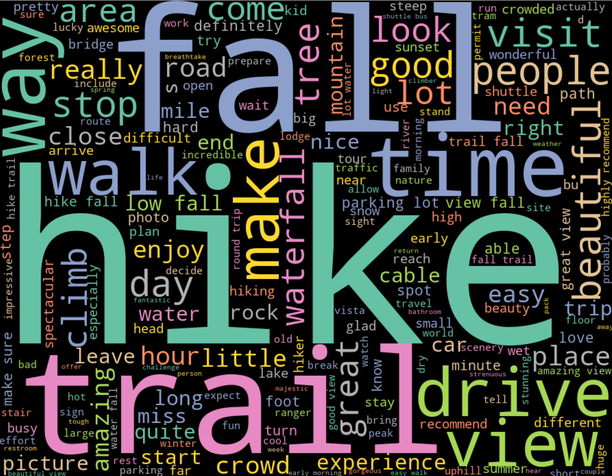
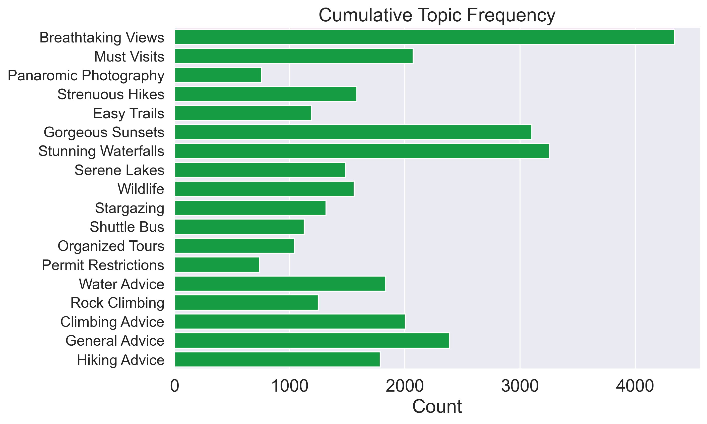

# Trip Advisor National Parks

## Motivation
Whether you're a travel aficionado or a once-in-a-blue-moon vacationer, one of the most vital aspects for a successful trip is figuring out how you should spend your time at your destination - which is always a laborious undertaking!  It's very easy to get a huge list of "Must-see" for any place you are planning to visit, but many additional hours of research is required to understand which must-see points fits in with your preferences.

## Objective
Focusing on a single tourism destination - Yosemite National Park, I will be using reviews of attractions listed under "Top Things To Do" on its **Trip Advisor** page, to create a travel preferences recommendation system, using NLP based Topic Modeling techniques.

## Data Sources

10,000+ reviews were scrapped from [Trip Advisor](www.tripadvisor.com).   
Specifically, their top attractions for [Yosemite National Park](https://www.tripadvisor.in/Attractions-g61000-Activities-Yosemite_National_Park_California.html) was used to obtain a list of attractions and then reviews from each individual [attraction's page](https://www.tripadvisor.in/Attraction_Review-g61000-d139187-Reviews-Glacier_Point-Yosemite_National_Park_California.html) was used to obtain the reviews itself.  

## Approach

The scraped reviews underwent three steps of processing.

#### 1. [Pre-processing (Cleaning)](https://github.com/navish92/Trip_Advisor_National_Parks/blob/main/Notebooks_Python_Files/2-NLP_Preprocessing.ipynb)

The corpus of documents were cleaned using regex, NLTK & Spacy using the following steps:
- All characters were converted to lower case
- All website links were removed by referencing any text that started with "http"
- All emails were removed by identifying any text with a '@' in between its characters
- Text with certain punctuations were substituted with whitespace (a lot of reviews contain text such as difficult/strenous - this helps clean that up).
- Everything except English alphabets & whitespace were dropped
- Using Spacy, all words were lemmatized
- Using the default 'Stop Words' list from sklearn, a majority of the stop words were removed (except words such as "not", "no")
- A list of custom additional stop words were made. Primarily, this comprised of the names of attractions. Extra words were added based on feedback from topic modeling.  
Finally, a new column called 'Outlook Sentiment' was made using the ratings on each review - a 4 or 5 rating corresponded to a positive outcome, and the rest negative.

The word cloud below provides a glimpse of the words present in the cleaned corpus.

#### 2. [Topic Modeling](https://github.com/navish92/Trip_Advisor_National_Parks/blob/main/Notebooks_Python_Files/3-Topic_Modeling_Corex.ipynb)

Various topic modeling approaches were tried, including NMF, LSA, LDA & Corex. Ultimately, Corex was found to yield the best results, especially due to its semi-supervised nature enabled by the use of anchor words. 18 topics were finally settled on, with a Total Correlation (TC) score of 24.75.  

The chart below shows the various topics & the number of documents falling under each of them. (Note: A document can & often belongs under more than one topic; but differ in how strongly they score under each topic)

#### 3. [Topic Interpretation and Recommendion System](https://github.com/navish92/Trip_Advisor_National_Parks/blob/main/Notebooks_Python_Files/4-Topic_Interpretation_and_Recommender.ipynb)  

The obtained topics were further analyzed using Logistic Regression. They were used as features with the outlook sentiment serving as the target variable. The coeffecients for each topic were informative in providing insight on which topics usually led to a more positive outcome.  
Additional analysis on the trend for topics over time & dimensionality reduction/clustering was also performed to gain a deeper understanding of the topics.  
Most importantly, a recommender system was built to finally wrap everything in a user-centric manner. 

## Recommendation System

From the 18 topics that were found, 12 were chosen to be used for the front end aspect of the recommendation system. These are:
- Breathtaking Views
- Must Visits
- Panaromic Photography
- Strenuous Hikes
- Easy Trails
- Gorgeous Sunsets
- Stunning Waterfalls
- Serene Lakes
- Wildlife
- Stargazing
- Shuttle Bus
- Organized Tours

The choice & naming for the above topics were done based on domain knowledge, as I am an avid traveler and a huge fan of the U.S. National Parks system.  
    
The user can enter their top 3 priorities for their trip to Yosemite National Park. Using cosine similarity, they will be provided 3 attractions to prioritize on accordingly. The interactive version of this app was deployed onto a web interface using Streamlit.  

## Other Findings

Based on simple aggregate measures, **Shuttle Bus, Organized Tours,** and **Hiking Advice** topics had the highest negative reviews contribution, at 5% of their respective total occurances under that topic. This isn't surprising, as all of these would be areas where people may face higher grievances and potentially express them. 

Using a logistic Regression model, where the topics served as features and the sentiment outlook as target, the following feature coefficients were obtained to gain further insight. 

**Hiking Advice** contributing the most towards a higher negative outcome makes sense, since people who faced certain issues would be more expressive of their problems & share advice to help future travelers. Correspondingly, **Climbing Advice** and **Beautiful Views** corresponding to highest postive outcomes intuitively also makes sense, as Yosemite does have exceedingly good views and people who tend to undertake climbing activities are known to very openly & freely share advice to help the next climber (missteps in climbing can lead to serious injuries/death).   

Overall, since the number of positive reviews far outnumbered the negative reviews (25:1), the above findings should be considered with a grain of salt.

## Future Work

The work done thus far looks incredibly promising. As part of next steps, the following can be undertaken:  
1. Expand to include all attractions that contain 10+ reviews on Trip Advisor for Yosemite National Park
1. Change recommender to provide 'n' destinations, instead of just 3, based on user preference
1. Repeat process for 10+ National Parks and extend the above recommender facility.
1. Add option to be able to state likes/dislikes in one park's attractions to recommend attractions' in another park.

## Tools Used

- NLTK
- SpaCy
- CorEx
- Pandas
- Scikit-learn (Feature Extraction, Decomposition, Linear Models, Pairwise Metrics)
- Matplotlib / Seaborn / Word Cloud / Scattertext
- Selenium
- Streamlit

## Skills Demonstrated

- Natural Language Processing (Pre-processing, Topic Modeling)
- Unsupervised Learning
- Dimensionality Reduction 
- Visualization
- Web scraping
